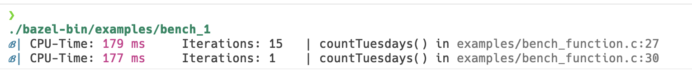

# Simple Bench
An C-header only library for a simple benchmark of a function or code_block.
Two macros are (currently) provided:

BENCH(FCALL, ITERATIONS) - Benchmarks the function FCALL ITERATIONS times

S_BENCH(FCALL) - Benchmarks the function FCALL once

## Usage

```c
int main() {
  // Benchmark the function 15 times
  BENCH(countTuesdays(), 15);

  // Benchmark just once:
  S_BENCH(countTuesdays());
  return 0;
}
```
results in:


## Installation
After cloning the repository, you can build the library with:
```bash
bazel build //src:simple_bench
```
