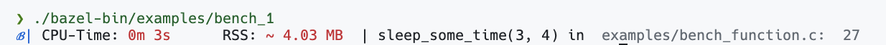

# Simple Bench
An C-header only library for a simple benchmark of a function or code_block.
One macros is (currently) provided:

BENCH(FCALL) 

where FCALL is a function call or a code block.
The macro will print the (CPU) time it took to execute the function call or code block.
And it returns from "rusage" a snapshot of the current resource usage (RSS) of the function. Of course it is more a hint of the real memory comsunption of the function.

## Usage

```c
int main() {

  BENCH(countTuesdays(3,4));

  return 0;
}
```
results in:


## Installation
After cloning the repository, you can build the library with:
```bash
bazel build //src:simple_bench
```
